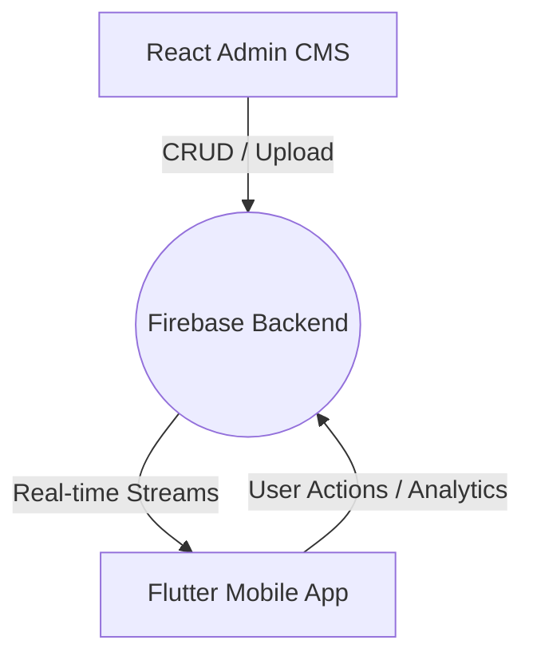

# StoryVerse Firebase Schema and Architecture

## Single Source of Truth
Firebase Firestore is the canonical source of all StoryVerse content. Both the React Admin Panel and the Flutter Mobile App must read and write to this identical database.

**Project ID**: `storyverse-465bd`

## Data Flow


## Collections & Documents

### 1. Stories
**Path:** `stories/{storyId}`
Contains all top-level story metadata.

```json
{
  "id": "string",
  "title": "string",
  "shortDescription": "string",
  "fullDescription": "string",
  "categoryId": "string",
  "genreId": "string",
  "tags": ["string"],
  "author": "string",
  "language": "string",
  "status": "draft | published",
  "isPublished": "boolean",
  "isTrending": "boolean",
  "episodeCount": "number",
  "views": "number",
  "rating": "number",
  "thumbnailUrl": "string",
  "bannerUrl": "string",
  "createdAt": "timestamp",
  "updatedAt": "timestamp"
}
```

### 2. Episodes
**Path:** `stories/{storyId}/episodes/{episodeId}`
Contains the actual playable content for a specific story.

```json
{
  "id": "string",
  "storyId": "string",
  "episodeNumber": "number",
  "title": "string",
  "description": "string",
  "thumbnailUrl": "string",
  "videoUrl": "string",
  "audioUrl": "string",
  "durationSeconds": "number",
  "status": "draft | published",
  "createdAt": "timestamp",
  "updatedAt": "timestamp"
}
```

### 3. Users
**Path:** `users/{uid}`
Contains user profiles and roles.

```json
{
  "uid": "string",
  "email": "string",
  "role": "user | admin",
  "isActive": "boolean",
  "createdAt": "timestamp"
}
```

### 4. Advertisements
**Path:** `advertisements/{adId}`
Contains banner ads displayed across the mobile app.

```json
{
  "id": "string",
  "title": "string",
  "subtitle": "string",
  "imageUrl": "string",
  "targetRoute": "string",
  "ctaText": "string",
  "priority": "number",
  "isActive": "boolean",
  "createdAt": "timestamp"
}
```

## Storage Structure
- `stories/{storyId}/thumbnail/` - Story cover images
- `stories/{storyId}/banner/` - Wide banners for details page
- `stories/{storyId}/episodes/{episodeId}/thumbnail/` - Episode specific covers
- `stories/{storyId}/episodes/{episodeId}/video/` - Uploaded video files

## Migration & Alignment Notes
- The React Admin Panel must save `categoryId` and `genreId` instead of just `category` to align with the Flutter App schema.
- The Flutter App must migrate from `Future<List>` (`get()`) to `Stream<List>` (`snapshots()`) to ensure real-time synchronization.
- Fallbacks to local demo catalogs should only occur during catastrophic network failure, not as a silent bypass for missing data.
